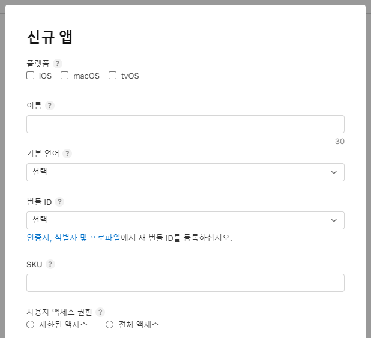

## IOS Distribution
React native webview app 등록과정 기록

## 순서
1. [신규 앱 생성](1.신규앱생성)

### 1. 신규 앱 생성
App Store Connect 에서 진행 (이하 과정도 동일)

 
 

- 이름 : 앱스토어에 나타낼 이름
- 번들 ID : Xcode에 사용한 이름과 같다고 나와있지만 expo 사용해서 빌드했기 때문에 expo가 생성해준 번들ID 를 선택  
(처음 만들때는 app.json에서 입력한 bundleIdentifier 앞에 여러 문자가 섞인 설명이 있었지만 나중에 빌드를 올린 후에는 설정한 빌드ID 만으로 바뀌었음)
- SKU : 앱의 고유 ID 앱스토어에 표시되지 않는다.
- 사용자 엑세스 권한 : 전체 엑세스로 설정

### 2. 앱 정보 입력

- 버전정보
1. 앱 미리보기 및 스크린샷 
    - 미리보기는 앱 구동 영상
    - 4가지 스크린샷 : 아이폰(2) + 태블릿(2)
    - https://studio.app-mockup.com/ 이 사이트를 통해 쉽게 스크린샷 이미지를 만들 수 있다. 하지만 ipad 2세대 device가 없음😥
  2. 프로모션 텍스트
      - 업데이트된 사항을 제출하지 않고 현재 앱 기능을 알릴 수 있다.
  3. 설명
      - 앱의 특징과 기능에 대한 설명
  4. 키워드, 지원URL, 마케팅URL

 

- 앱 정보
1. App Store 아이콘
    - 빌드 제출하면 생성됨
2. 저작권
3. 버전

 

- 앱 심사 정보
1. 로그인 정보
    - 앱 기능이 로그인이 필요한 경우 제출
2. 연락처 정보
    - 심사 팀에서 연락할 담당자 정보
    - 심사 리뷰가 여기서 쓴 이메일로 올 줄 알았는데 따로 올라오는 공간이 있었다
3. 메모
    - 앱 흐름이나 알려줄 정보가 있을 경우 작성
    - 데이터가 별로 없는 경우 리젝된다는 글을 봤어서 조회 할 데이터가 있는 날짜등을 미리 기입했다
4. 첨부파일

 

- 버전 출시
    - 심사팀 승인 이후 자동 출시로 설정

### 3. 일반 정보 입력
- 앱 정보 (위에서 정한 것들과 중복 O)
1. 카티고리
2. 콘텐츠 권한
    - 타사 콘텐츠 포함 or 미포함
3. 등급
    - 앱 내용에 따라 4+, 9+, 12+, 17+ 로 나뉜다
    - 앱에서 다른 웹이나 유튜브 등으로 연결될 경우 심사 때 최소 12+ 요구한다

 

- 가격 및 사용 가능 여부

 

- 앱이 수집하는 개인정보
1. 개인정보 처리방침 URL
    - 개인정보 처리방침을 볼 수 있는 링크 입력. 없으면 리젝사유
2. 제품 페이지 미리보기

3. 데이터 유형
    - 데이터 수집여부, 수집한다면 무엇을 하는지 설정

### 4. TestFlight
사용자, 빌드 추가 후 앱 테스트
- 테스터는 TestFlight 앱을 가지고 있어야하며, 메일로 오는 초대 수락 후 코드 교환으로 테스트 가능
- 최초 테스트 이후에는 업데이트 버튼으로 빌드 업데이트 가능

### 5. 제출하기
제출 후 심사를 받으면 되는데 약 50% 가 하루 이내에 리뷰를 받게 된다고 한다

---
### 참고
- [App Store Connect](https://appstoreconnect.apple.com/apps)

