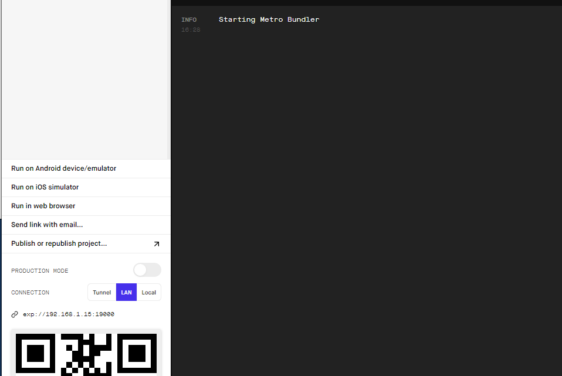

# Get started
## 1. Installation
- react-native
  ```bash
  $ yarn add react-native
  ```
- [expo](./expo.md) (optional)
    - react-native 개발을 쉽게 할 수 있도록 도와주는 프레임워크/플랫폼
  ```bash
  $ yarn add expo-cli
  ``` 
  
  - 안드로이드 개발을 위한 설치
    - Android studio 
    - jdk 16

## 2. Project init
```bash
$ expo init rn-project
$ cd rn-project
$ expo start
```

## 3. Start
```bash
$ expo start
```
- npm start, yarn start 모두 가능
- Android Emulator가 있다면 연결해서 볼 수 있다. Android studio 설치했다면 a 눌러서 (or 사이드바의 Run on Android device/emulator) 에뮬레이터로 확인가능



## Issue
### Couldn't start project on Android: The emulator (Pixel_API_26) quit before it finished opening.
- 안드 스튜디오에서 에뮬레이터 run한 후에 연결


### 참고
- [docs.expo](https://docs.expo.dev/)
- https://withhamit.tistory.com/357
- 

