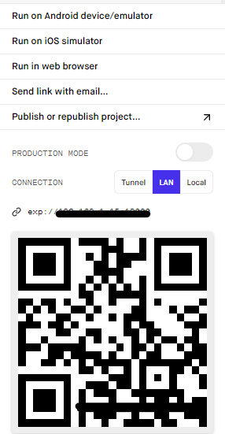

# Expo
- RN 개발을 좀 더 쉽게 할 수 있게 도와주는 유틸리티 기능이 있는 플랫폼 (React의 CRA와 비슷)
  
👍 Setup이 되어있기 때문에 개발이 간편하다
👍 배포또한 expo가 해주기때문에 간편하다

👎 Expo가 제공하는 API만 사용가능하기 때문에 좀 더 다양한 기능이 필요하다면 React Native CLI 로 개발해야한다
👎 간단한 app이라 하더라도 기본 크기가 크다


## Get started
### 1. Installation
```bash
# Install the command line tools
$ npm install --global expo-cli
# yarn 도 가능

#Create a new project
$ expo init my-project
```

### 2. Starting the development server
```bash
$ expo start
```
  


연결된 기기나 가상기기가 있다면 Run on~ 메뉴를 눌러 확인할 수 있고, expo앱을 받아서 스캔 or 열린 프로젝트를 선택해서 테스트해 볼 수 있다

### 3. Building Standalone Apps
- app.json
```json
 {
   "expo": {
    "name": "Your App Name",
    "icon": "./path/to/your/app-icon.png",
    "version": "1.0.0",
    "slug": "your-app-slug",
    "ios": {
      "bundleIdentifier": "com.yourcompany.yourappname",
      "buildNumber": "1.0.0"
    },
    "android": {
      "package": "com.yourcompany.yourappname",
      "versionCode": 1
    }
   }
 }

```
- start the build
```
expo build:android

expo build:ios
```
  - expo build:android에서 app을 선택하면(app-bundle 🙅‍♂️) 빌드 후 나오는 링크를 통해 .apk 파일을 받을 수 있다

<br>
<br>

  📌스토어에 등록 된 이후에는 build 명령어는 publish가 같이 된다. test app이 필요한 경우 release-channel 과 함께 build / publish 해야 한다!!

<br>


### Publish
```bash
expo publish
```
store에 등록되어 있는경우 build만 하더라도 [OTA](#OTA)로 업데이트 된다


### Release-channel
처음 expo init, publish 하면 release channel은 default. 이후 build 할 때 마다 OTA 업데이트가 이뤄지기 때문에 유저에게 업데이트 하지 않고 standard app을 만들고 싶다면 다른 release channel을 사용해서 build하면 된다

```bash
expo build:ios --release-channel dev
expo build:android --release-channel staging

//dev, staging 채널로 build 
```

### 참고
- [Expo](https://docs.expo.dev/)
- [Expo-Updating-your-App](https://docs.expo.dev/bare/updating-your-app/)

## OTA
Over-the-air : App Store나 Playstore에 앱 최초 등록 이후, JS번들 업데이트의 경우에는 앱을 다시 올리지 않고 업데이트 할 수 있는 기술

App을 실행할 때마다 번들을 체크해서 업데이트할 번들이 있는경우 바로 업데이트 된다. Expo의 경우 Expo서버에 저장되어 있는 번들(publish, build된 버전)이 자동으로 업데이트


