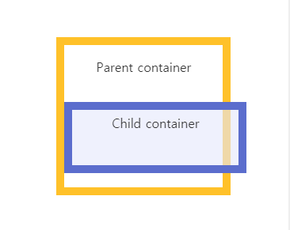
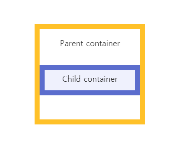

# Box-sizing

## content-box
- box size는 content만 포함
- border, padding은 box 바깥에 생긴다  
```
box-sizing: content-box;
width: 100%;
border: solid #5B6DCD 10px;
padding: 5px;
```
  
  
---  
## border-box
- box size에 padding, border 포함  
```
box-sizing: border-box;
width: 100%;
border: solid #5B6DCD 10px;
padding: 5px;
```
  

### 참고
- [MDN boxsizing](https://developer.mozilla.org/en-US/docs/Web/CSS/box-sizing)