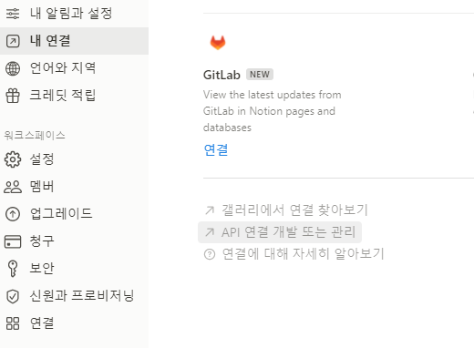
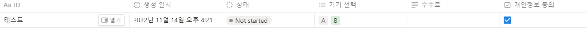

# Notion
## Notion API 
## 1. Create API Key and Connect Database
  1) https://www.notion.com/my-integrations - 새 API 통합 만들기
  2) 연결할 데이터베이스 페이지로 이동 - 오른쪽 상단 점 세개 선택
  3) 연결 추가 - 1 에서 만든 API 선택



## 2. Authorization and headers
  1) integrations API 페이지에서 secret key 복사
  2) header 에 Authorization = 복사한 키 넣기
  3) Notion-Version = '2022-06-28'  
  (https://developers.notion.com/reference/changes-by-version 참고)

## 3. Usage
-  [database](#Database)
-  [page](#page)

---

## Database
- id는 페이지 링크 복사했을 때 / 와 ?v= 사이에 존재

### 데이터베이스 가져오기 
- [GET] https://api.notion.com/v1/databases/:id


```js
//response sample 
{
    "object": "database",
    "id": "",
    "cover": null,
    "icon": null,
    "created_time": "2022-11-14T01:07:00.000Z",
    "created_by": {
        "object": "user",
        "id": ""
    },
    "last_edited_by": {
        "object": "user",
        "id": ""
    },
    "last_edited_time": "2022-11-14T01:25:00.000Z",
    "title": [
        {
            "type": "text",
            "text": {
                "content": "APITEST",
                "link": null
            },
        }
    ],
    "properties": {
      //properties~~
    },
    "parent": {
        "type": "workspace",
        "workspace": true
    },
    "url": "database",
    "archived": false
}
```

### 전체 리스트 가져오기
- [POST] https://api.notion.com/v1/databases/:id/query

```js
//response sample 
{
  "object": "list",
  "results": [
    {
      "object": "page",
      "id": "74508739-302e-432a-bd61-9d2618640ef8",
      "created_time": "2022-11-14T05:47:00.000Z",
      "last_edited_time": "2022-11-14T05:50:00.000Z",
      "created_by": {
          "object": "user",
          "id": "0ebf8de0-13c3-46d7-b216-61dc77eebcaf"
      },
      "last_edited_by": {
          "object": "user",
          "id": "484f408b-1dce-4183-9e1a-163b2ec12d70"
      },
      "cover": null,
      "icon": null,
      "parent": {
          "type": "database_id",
          "database_id": "c090b9b0-0d69-461c-b915-669d88810581"
      },
      "archived": false,
      "properties": {
        //~~properties~~
      },
      //...
      "url":"https://www.notion.so/..."
    },
    {
      //page
    }, //...{page},{page}
  ]
}
```

- SORT, FILTER -> body 에 조건 추가


## Page
### Page 만들기
- [POST] https://api.notion.com/v1/pages/
- columns 
  > ID (기본 text)
  > 생성 일시 (created_time) 
  > 상태 (status) 
  > 기기 선택 (multi_select)
  > 개인정보 동의 (checkbox)

```js
//request sample
{
    "parent": {
        "database_id": "database_id 입력"
    },
    "properties": {
        "ID": {
            "type": "title",
            "title": [
                {
                    "type": "text",
                    "text": {
                        "content": "테스트"
                    }
                }
            ]
        },
        "기기 선택" : {
            "multi_select" : [
                {"name":"A"}, {"name": "B"}
            ]
        },
        "개인정보 동의" : {
            "checkbox" : true
        }
    }
}
```



---
### 참고
- [노션 개발자 페이지](https://developers.notion.com/)
- [Notion API Postman](https://www.postman.com/notionhq/workspace/notion-s-api-workspace/documentation/15568543-d990f9b7-98d3-47d3-9131-4866ab9c6df2)