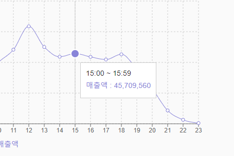

# Recharts

## xAxis format
- tickFormatter 사용 (+ date-fns)
- 'yyyy-MM-dd' -> 'M-d'
```js
<XAxis
 dataKey='date'
 tickFormatter={(value) => format(new Date(value), 'M-d')}
>
```

## yAxis
- 숫자 단위 생략
```js
const yAxisTickFormatter = (value) => {
    const yValue = value * 1;
    if (yValue > 10000000) {
      return (yValue / 10000).toLocaleString('en-US');
    } else {
      return yValue.toLocaleString('en-US');
    }
  };
```

## Tooltip
- formatter
  - value : 45,709~
  - name : 매출액

- labelFormatter
  - label : 15:00 ~ 15:59
;
  
```js
const customTooltipLabel = (label) => {
    if (category === 'time') {
      return `${label}:00 ~ ${label}:59`;
    } else {
      return label;
    }
  };

<Tooltip
  formatter={(value) => value.toLocaleString('en-US')}
  labelFormatter={customTooltipLabel}
/>
```
- name, value 둘다 바꾸는 경우
- (name, value) => [name, value]
```js
const tooltipFormat = (value, name) => {
    const newValue = `${(value * 1).toLocaleString('en-US')}원`;
    if (category === 'time') {
      let timeRange = `${name}:00 ~ ${name}:59`;
      return [newValue, timeRange];
    } else if (category === 'day') {
      let timeRange = format(new Date(name), 'M월 d일');
      return [newValue, timeRange];
    } else if (category === 'week') {
      return [newValue, getWeekDay(name * 1)];
    } else {
      let timeRange = format(new Date(name), 'M월');
      return [newValue, timeRange];
    }
  };
```